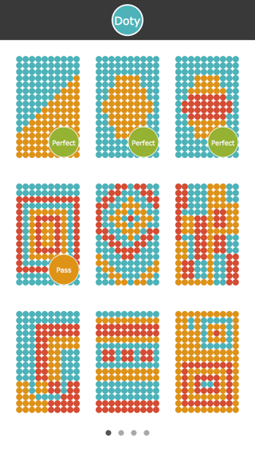
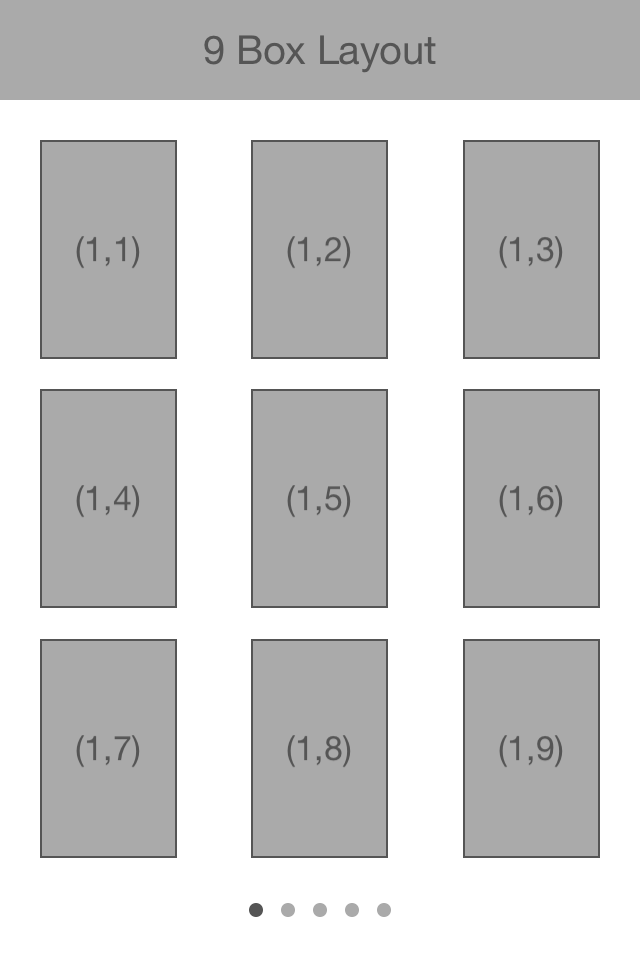
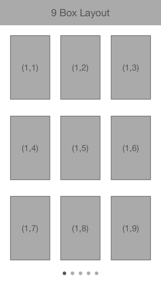
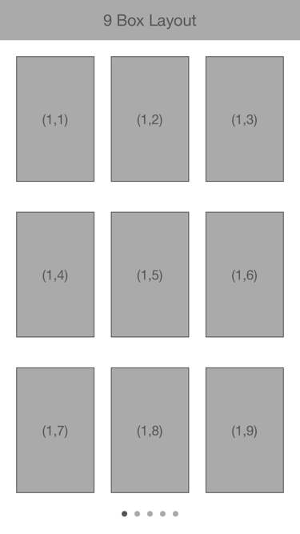
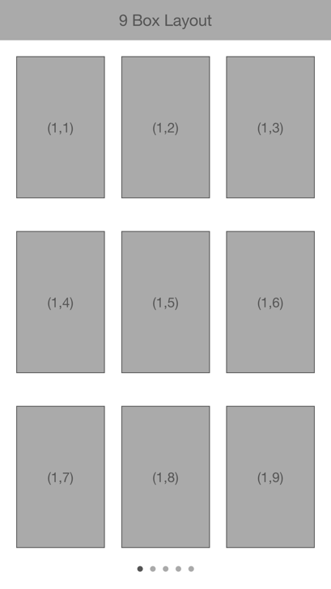

It is just like the level choice UI in [Doty](https://itunes.apple.com/app/doty-tiny-fun-puzzle-game/id1006086893)

 

ScreenShot of this sample:

iPhone4S

 

iPhone5S

 

iPhone6

 

iPhone6P

